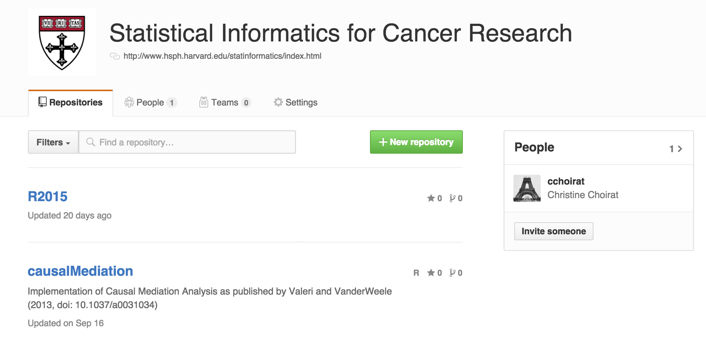
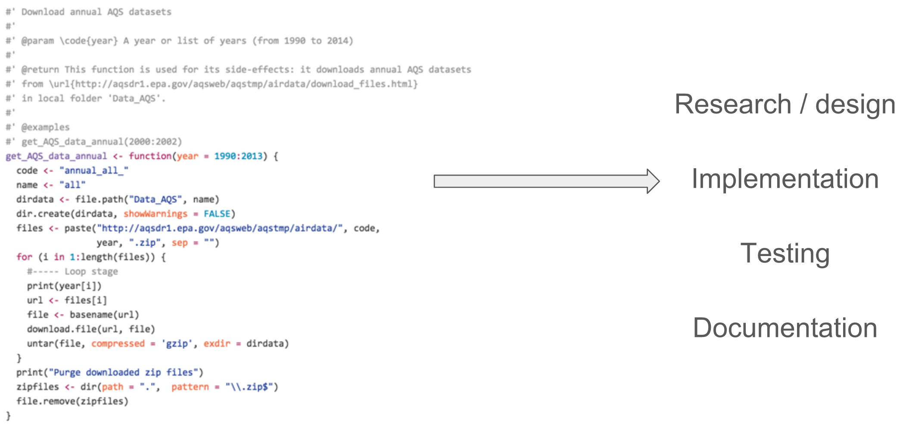
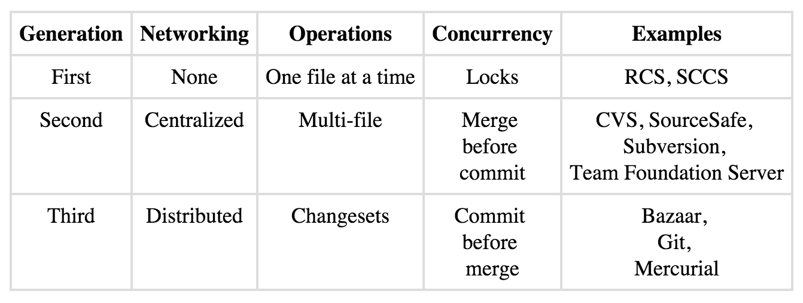
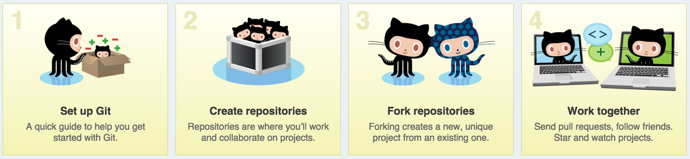
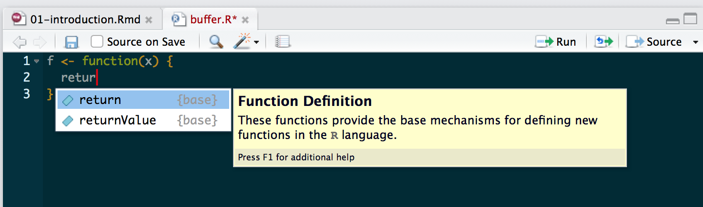
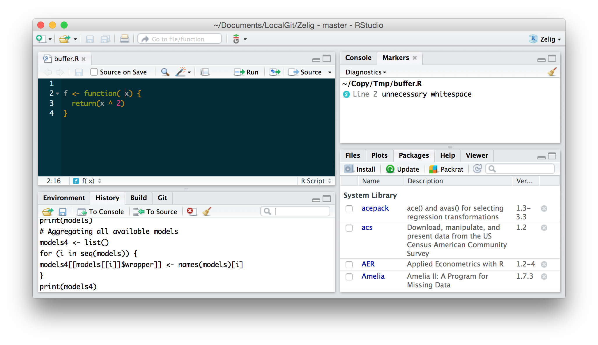

# Course presentation

## This is not...

- An introduction to R
    - Coursera: https://www.coursera.org/course/rprog
    - edX: https://www.edx.org/course/introduction-r-programming-microsoft-dat204x-0

- A Data Science class
    - Harvard: http://cs109.github.io/2015/
    - Coursera: https://www.coursera.org/course/startup

- A Statistics / Machine Learning / Data Visualization / ... class

- No grades, no credits

## P01

<iframe src="http://www.hsph.harvard.edu/statinformatics/"></iframe>

## Objectives

- Training

- Deliverables

- Lectures are the tip of the iceberg

## Schedule {.columns-2}

(12:30-1:30pm, room 426)

Priority registration for P01 participants:

- October 19 (room change: Kresge 907)

- October 26

- November 2

- November 9

Restricted (with flexibility) to P01 participants:

- March 7

- March 14

- March 21

- March 28

## Labs

Limited to 10 P01 participants:

- November 6 (Kresge G2)

- November 11 (426).  Should we reschedule?

- March 16 (426)

- March 23 (Kresge 907)

- March 30 (Kresge 907)

## Useful resources and references

- Books by [Hadley Wickham](http://had.co.nz/)
    - [Advanced R](http://adv-r.had.co.nz/)
    - [R packages](http://r-pkgs.had.co.nz/)    

- P01 Github
    - https://github.com/harvard-P01
    - This R course
    - Packages (in R or not)

- Google Groups
    - https://groups.google.com/forum/#!forum/harvard-p01

## [P01 GitHub](https://github.com/harvard-P01)



- Central repository

- Keep ownership

## Program

### Lectures

- Lecture 01: Introduction, GitHub

- Lecture 02: Creating R packages

- Lecture 03: Data manipulation grammars

- Lecture 04: OPEN (Interactive Graphics, GIS, C++, ...)

- Lectures 05, 06, 07, 08: TBD, depending on the accepted projects

### Labs

- Labs 01, 02: 2 x 5 presentations of your software project

- Labs March: 3 x 3-ish presentations of your software packages

## Statistics, Software Engineering, Data Science

- Code: Script / Software
- Data
- Best practices / Workflows: __reproducibility__ (more next week)



# GitHub

## Version control systems (VCS)

- myfile1-v1.R, myfile-v2.R, myfile2-v2-old.R, myfile-v3-failed.R, ..., myfile-final-final-2.R 

- [Tools](http://ericsink.com/vcbe/html/history_of_version_control.html) to track and control changes to documents



## A short [history](https://www.plasticscm.com/version-control-history.html) of VCS

<iframe src="https://www.plasticscm.com/version-control-history.html"></iframe>

## Git

- Desing principle: _take Concurrent Versions System (CVS) as an example of what not to do; if in doubt, make the exact opposite decision_

- https://git-scm.com/
    - https://git-scm.com/doc
    - https://git-scm.com/book/en/v2
    - https://git-scm.com/videos

- https://guides.github.com/

- https://www.atlassian.com/pt/git/workflows#!workflow-gitflow

- https://illustrated-git.readthedocs.org/en/latest/

## Distributed version control

<div class="centered">

</div>

## SHA-1

```{r}
cos(1)
cos(1.01)
```

```{r}
digest::digest("P01", algo = "sha1")
digest::digest("P01.", algo = "sha1")
```

## Branching


## Workflow and terminology


## GitHub



## Even [without the command line](https://desktop.github.com/)

<iframe src="https://desktop.github.com/"></iframe>

## From the web interface

- Let's create a `sandbox` repository.

# Choosing an editor / IDE

## Nice features to have: editor



- Syntax highlighting
- Autocompletion
- Autoindentation
- Help popups
- Shortcuts
- Macros / templates

## Nice features to have: IDE

- R console
- Package management
- Build tools
- Git integration
- Static code parser

## RStudio



## Other popular choices

- Base R

- Emacs / XEmacs / Aquamacs + [ESS](http://ess.r-project.org/)

- Sublime + e.g. [R-Box](https://github.com/randy3k/R-Box)

- vi + [R plugin](http://www.vim.org/scripts/script.php?script_id=2628)

- Eclipse + [StatET](http://www.walware.de/goto/statet)

- ...

# RefreshR 

## IQSS [Rintro](http://tutorials.iq.harvard.edu/R/Rintro/Rintro.html) by [Ista Zahn](http://www.iq.harvard.edu/people/ista-zahn)

<iframe src="http://tutorials.iq.harvard.edu/R/Rintro/Rintro.html"></iframe>

## IQSS [Rprogramming](http://tutorials.iq.harvard.edu/R/RProgramming/Rprogramming.html) by [Ista Zahn](http://www.iq.harvard.edu/people/ista-zahn)

<iframe src="http://tutorials.iq.harvard.edu/R/RProgramming/Rprogramming.html"></iframe>

# Homework

## For next week

- Create a GitHub account

- Play wih the P01 sandbox

## For the labs

_Participation will be decided by a P01 committee based on a short description (1/2 page) of your research and how it relates to the objectives of the P01, in particular: (1) the relevance of the R code you are working on and what you are planning to achieve with the labs, and (2) committing to having a working R package on GitHub by the end of the course._

- Send me a short email: 1/2 page project description with package name, intended audience, number of developers / users, planned developments

- If accepted
    - November 6 and 11 (TBC), 20 minute presentation of your project (stats background, walkthrough code review)
    - Create your package repository on https://github.com/harvard-P01 (even if empty for the moment)
