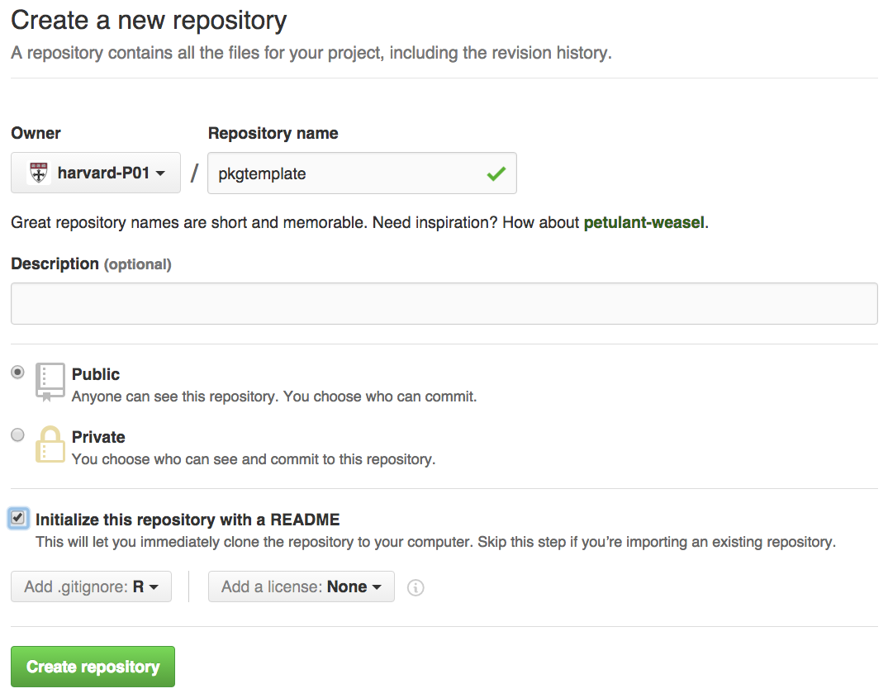
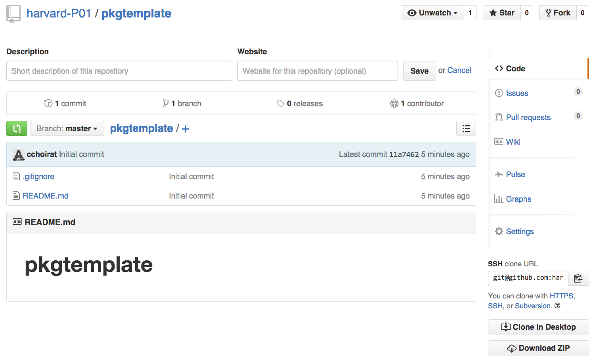
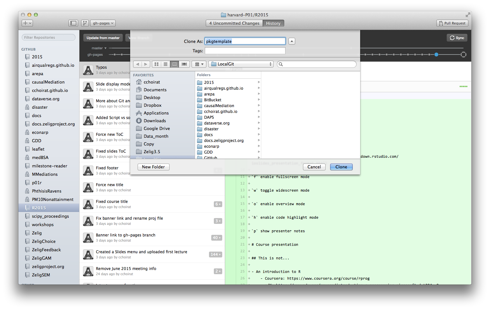
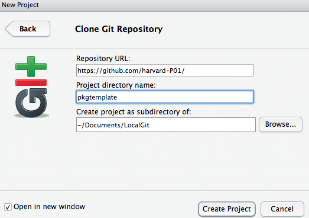
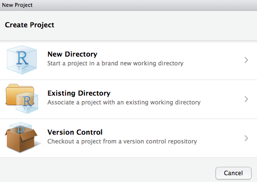
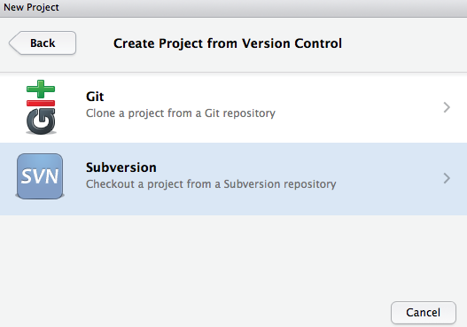
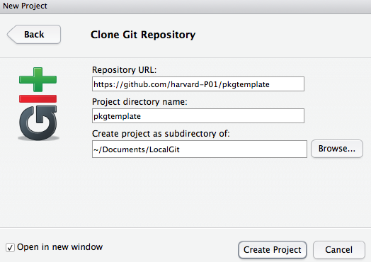
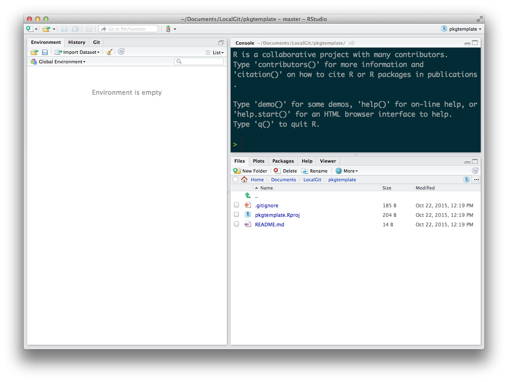

# R packages

## Why?

## Structure

## Creating an R package

### `utils::package.skeleton`

```{r eval=FALSE}
package.skeleton() # "in "fresh" session ("anRpackage")
package.skeleton("pkgname") # in "fresh" session

set.seed(02138)
f <- function(x, y) x+y
g <- function(x, y) x-y
d <- data.frame(a = 1, b = 2)
e <- rnorm(1000)
package.skeleton(list = c("f","g","d","e"), name = "pkgname")
```

### `devtools::create`

```{r eval=FALSE}
devtools::create("path/to/package/pkgname")
```

## RStudio and GitHub integration

<div class="centered">

</div>

- package name
- .gitignore
- README
## Installing from GitHub

```{r eval=FALSE}
devtools::install_github("harvard-P01/pkgtemplate")
```

## `.gitignore`

```{r eval=FALSE}
# History files
.Rhistory
.Rapp.history

# Example code in package build process
*-Ex.R

# RStudio files
.Rproj.user/

# produced vignettes
vignettes/*.html
vignettes/*.pdf
```

## Clone

<div class="centered">

</div>

<div class="centered">

</div>

then populate and push

## RStudio alternative

<div class="centered">

</div>

## RStudio alternative

<div class="centered">

</div>

## RStudio alternative

<div class="centered">

</div>

## RStudio alternative

<div class="centered">

</div>

## RStudio alternative

<div class="centered">

</div>

## RStudio alternative

<div class="centered">

</div>

## `.Rproj`

## Package documentation

- Functions and methods

- Vignettes
    - PDF
    - `knitr`

## S3 and S4 generics

## Workflow

- devtools
- ROxygen2

## Unit tests and `testthat`

## Makefiles and `make`

## Freezing package repositories

- MCRAN (???)

- Docker

# [Rcpp](http://www.rcpp.org/)

## C/C++ ressources

## C++

- C++ and Rcpp (direct interchange of R objects between R and C++): http://www.rcpp.org/.  Installation: platforms are not created equal
- Linux: enjoy your package manager!
- OS X
    - install Xcode from Apple
    - install the Command Line Tools
    - `install.packages("Rcpp"); install.packages("inline")`
- Windows
    - install Rtools: https://cran.rstudio.com/bin/windows/Rtools/
    - `install.packages("Rcpp"); install.packages("inline")`

## The inevitable rabbits

R does not handle recursive functions very well:

```{r}
fibo <- function(n) {
  if (n == 0)
    return(0)
  if (n == 1)
    return(1)
  return(fibo(n - 1) + fibo(n - 2))
}
```

```{r eval=FALSE}
system.time(fibo(35))
```

`fibo(35)` takes 25 seconds on my machine...

## C++ is __faster__

```{r}
library(Rcpp)
fibRcpp <- cppFunction( '
int fibo(const int n) {
   if (n == 0)
      return(0);
   if (n == 1)
      return(1);
   return (fibo(n - 1)) + fibo(n - 2);
}
' )
```

## C++ is __faster__

```{r}
fibRcpp
```

Performance is much better:

```{r}
system.time(print(fibRcpp(35)))
```

## `Rcpp` family

`RcppArmadillo`

> 'Armadillo' is a templated C++ linear algebra library (by Conrad Sanderson) that aims towards a good balance between speed and ease of use. Integer, floating point and complex numbers are supported, as well as a subset of trigonometric and statistics functions. Various matrix decompositions are provided through optional integration with LAPACK and ATLAS libraries. The 'RcppArmadillo' package includes the header files from the templated 'Armadillo' library.
