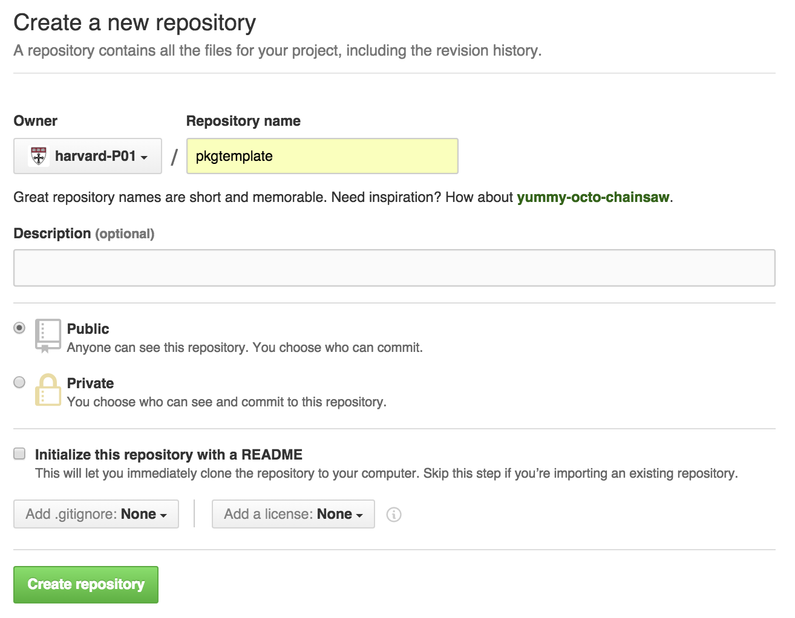
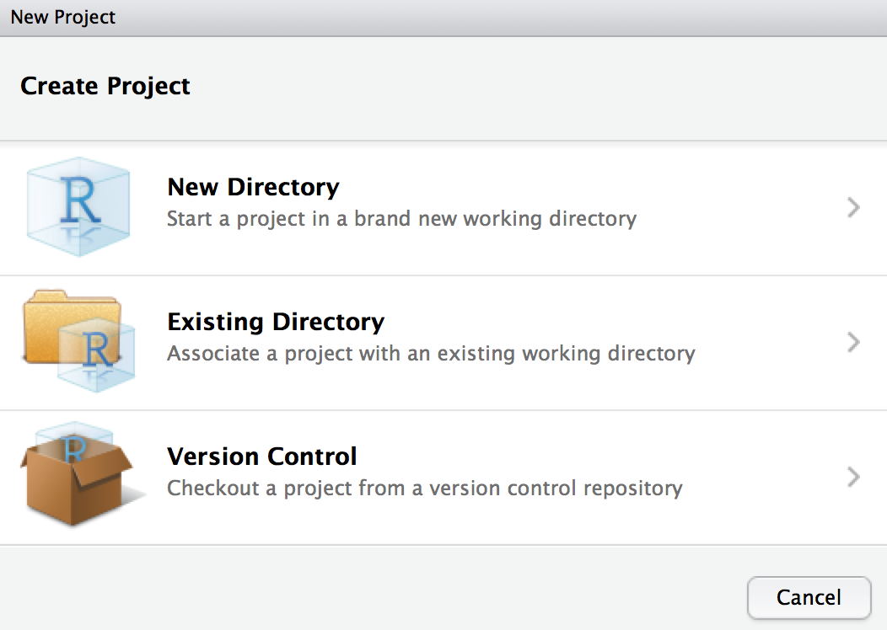
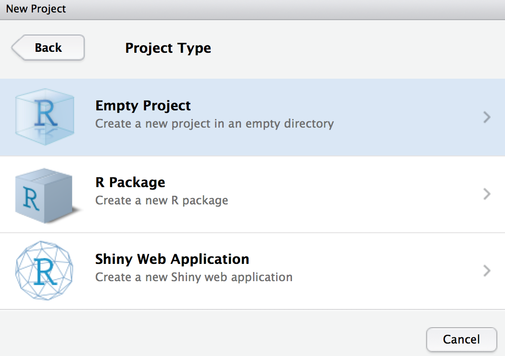
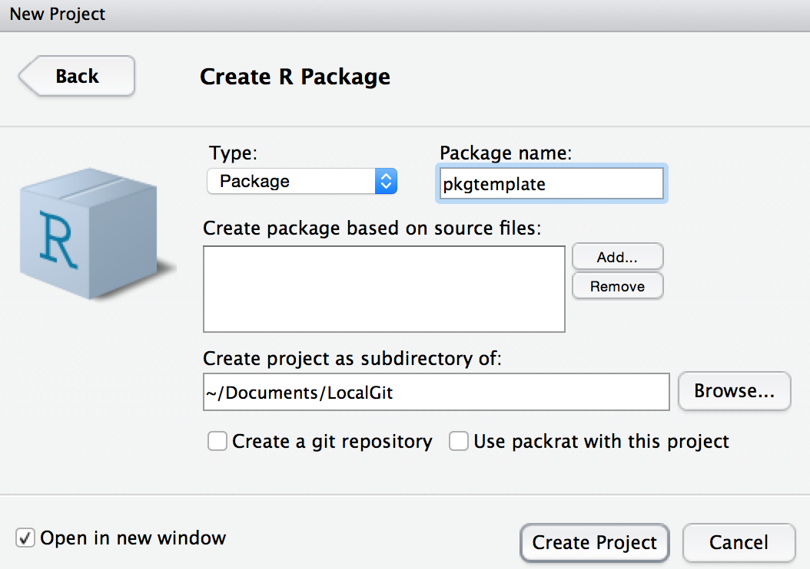
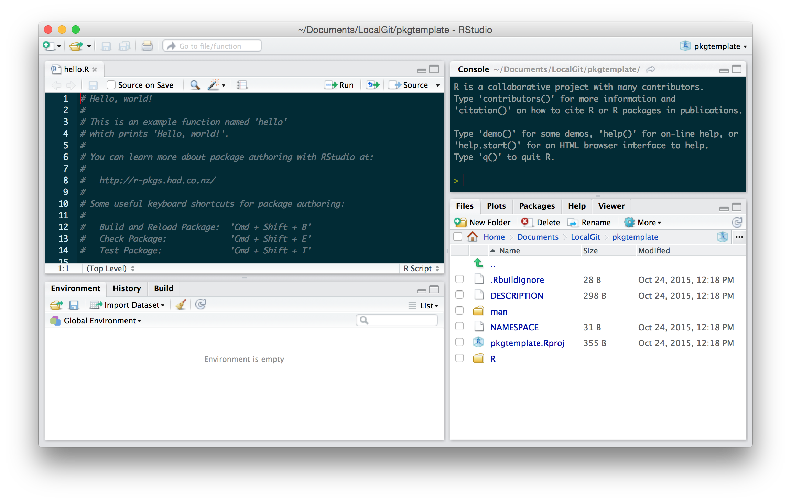
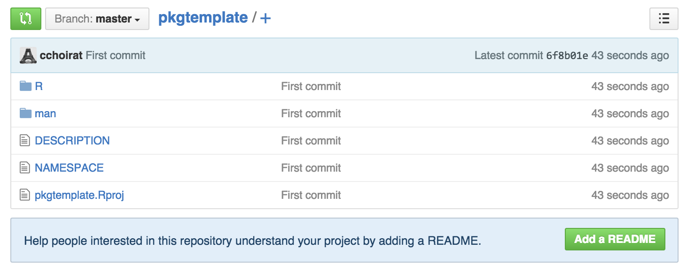
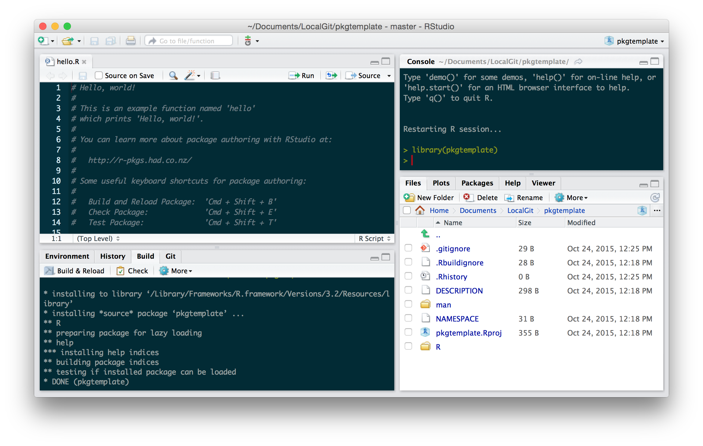
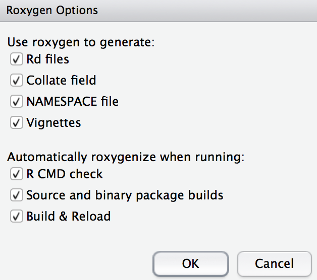
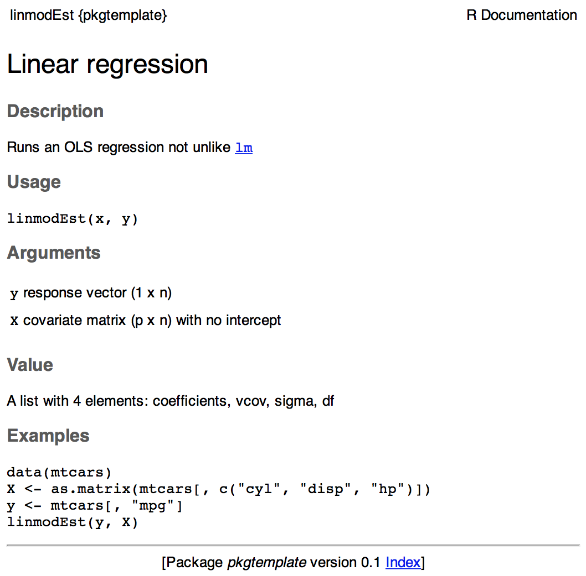

# R packages

## Why?

- Organize your code

- Distribute your code

- Version your code

## Structure

- Folder hierarchy
    - `NAMESPACE`: package import / export
    - `DESCRIPTION`: metadata
    - `R/`: R code
    - `man/`: object documentation (with short examples)
    - `tests/`
    - `data/`
    - `src/`: compiled code
    - `vignettes/`: manual-like documentation
    - `inst/`: installed files
    - `demo/`: longer examples
    - `exec`, `po`, `tools`

## Building steps

- `R CMD build`

- `R CMD INSTALL`

- `R CMD check`

## `R CMD build`

```{r eval=FALSE}
R CMD build --help
```

_Build R packages from package sources in the directories specified by ‘pkgdirs’_

## `R CMD INSTALL`

```{r eval=FALSE}
R CMD INSTALL --help
```

_Install the add-on packages specified by pkgs.  The elements of pkgs can be relative or absolute paths to directories with the package sources, or to gzipped package 'tar' archives.  The library tree to install to can be specified via '--library'.  By default, packages are installed in the library tree rooted at the first directory in .libPaths() for an R session run in the current environment._

## `R CMD check`

```{r eval=FALSE}
R CMD check --help
```

http://r-pkgs.had.co.nz/check.html

_Check R packages from package sources, which can be directories or package 'tar' archives with extension '.tar.gz', '.tar.bz2', '.tar.xz' or '.tgz'._

_A variety of diagnostic checks on directory structure, index and control files are performed.  The package is installed into the log directory and production of the package PDF manual is tested. All examples and tests provided by the package are tested to see if they run successfully.  By default code in the vignettes is tested, as is re-building the vignette PDFs._

## Building steps with `devtools`

- `devtools::build`

- `devtools::install`

- `devtools::check`

- and many others: `load_all`, `document`, `test`, `run_examples`, ...

## Creating an R package

### `utils::package.skeleton`

```{r eval=FALSE}
package.skeleton() # "in "fresh" session ("anRpackage")
package.skeleton("pkgname") # in "fresh" session

set.seed(02138)
f <- function(x, y) x+y
g <- function(x, y) x-y
d <- data.frame(a = 1, b = 2)
e <- rnorm(1000)
package.skeleton(list = c("f","g","d","e"), name = "pkgname")
```

### `devtools::create`

```{r eval=FALSE}
devtools::create("path/to/package/pkgname")
```

## Submitting to CRAN

<div class="centered">

</div>

http://r-pkgs.had.co.nz/release.html

## Using GitHub

<iframe src="http://r-pkgs.had.co.nz/git.html"></iframe>

## RStudio and GitHub integration (1 / 7)

<div class="centered">

</div>

## RStudio and GitHub integration (2 / 7)

<div class="centered">

</div>

## RStudio and GitHub integration (3 / 7)

<div class="centered">

</div>

## RStudio and GitHub integration (4 / 7)

<div class="centered">

</div>

## RStudio and GitHub integration (5 / 7)

<div class="centered">

</div>

## Command line

```{r eval=FALSE}
git init
git add *
git commit -m "First commit"
git remote add origin git@github.com:harvard-P01/pkgtemplate.git
git push -u origin master
```

## RStudio and GitHub integration (6 / 7)

<div class="centered">

</div>

## RStudio and GitHub integration (7 / 7)

<div class="centered">

</div>

## Installing from GitHub

```{r eval=FALSE}
devtools::install_github("harvard-P01/pkgtemplate")
```

```{r eval=FALSE}
devtools::install_github("harvard-P01/pkgtemplate", build_vignettes = TRUE)
```

## `.gitignore` (RStudio default)

```{r eval=FALSE}
.Rproj.user
.Rhistory
.RData
```

## `.gitignore` (GitHub default)

```{r eval=FALSE}
# History files
.Rhistory
.Rapp.history

# Example code in package build process
*-Ex.R

# RStudio files
.Rproj.user/

# produced vignettes
vignettes/*.html
vignettes/*.pdf
```

## RStudio projects

- `.Rproj` file extension, in our example `pkgtemplate.Rproj`

- A project has its own:
    - R session
    - .Rprofile (_e.g._, to customize startup environment)
    - .Rhistory

- Default working directory is project directory

- Keeps track of project-specific recent files

## Project options

```{r eval=FALSE}
Version: 1.0

RestoreWorkspace: Default
SaveWorkspace: Default
AlwaysSaveHistory: Default

EnableCodeIndexing: Yes
UseSpacesForTab: Yes
NumSpacesForTab: 2
Encoding: UTF-8

RnwWeave: knitr
LaTeX: pdfLaTeX

AutoAppendNewline: Yes
StripTrailingWhitespace: Yes

BuildType: Package
PackageUseDevtools: Yes
PackageInstallArgs: --no-multiarch --with-keep.source
```

## Package documentation

- Functions and methods

- Vignettes
    - PDF
    - `knitr` (or `Sweave`)

## Process example

Creating R Packages: A Tutorial (Friedrich Leisch, 2009 )

- https://cran.r-project.org/doc/contrib/Leisch-CreatingPackages.pdf

## Adding `linreg.R` in `R/` directory

```{r eval=TRUE}
linmodEst <- function(x, y) {
  ## compute QR-decomposition of x
  qx <- qr(x)
  ## compute (x’x)^(-1) x’y
  coef <- solve.qr(qx, y)
  ## degrees of freedom and standard deviation of residuals
  df <- nrow(x) - ncol(x)
  sigma2 <- sum((y - x %*% coef) ^ 2) / df
  ## compute sigma^2 * (x’x)^-1
  vcov <- sigma2 * chol2inv(qx$qr)
  colnames(vcov) <- rownames(vcov) <- colnames(x)
  list(
    coefficients = coef,
    vcov = vcov,
    sigma = sqrt(sigma2),
    df = df
  )
}
```

## Running our function

```{r}
data(cats, package = "MASS")
linmodEst(cbind(1, cats$Bwt), cats$Hwt)
```

## And compare with `lm` (1 / 2)

```{r}
lm1 <- lm(Hwt ~ Bwt, data=cats)
lm1
coef(lm1)
```

## And compare with `lm` (2 / 2)

```{r}
vcov(lm1)
summary(lm1)$sigma
```

## Adding ROxygen2 documentation

```{r eval=FALSE}
#' Linear regression
#'
#' Runs an OLS regression not unlike \code{\link{lm}}
#'
#' @param y response vector (1 x n)
#' @param X covariate matrix (p x n) with no intercept
#'
#' @return A list with 4 elements: coefficients, vcov, sigma, df
#'
#' @examples
#' data(mtcars)
#' X <- as.matrix(mtcars[, c("cyl", "disp", "hp")])
#' y <- mtcars[, "mpg"]
#' linreg(y, X)
#'
#' @export
#'
linmodEst <- function(x, y) {
  ## compute QR-decomposition of x
  qx <- qr(x)
  ## compute (x’x)^(-1) x’y
  coef <- solve.qr(qx, y)
  ## degrees of freedom and standard deviation of residuals
  df <- nrow(x) - ncol(x)
  sigma2 <- sum((y - x %*% coef) ^ 2) / df
  ## compute sigma^2 * (x’x)^-1
  vcov <- sigma2 * chol2inv(qx$qr)
  colnames(vcov) <- rownames(vcov) <- colnames(x)
  list(
    coefficients = coef,
    vcov = vcov,
    sigma = sqrt(sigma2),
    df = df
  )
}
```

## Configure Build Tools

<div class="centered">

</div>

## `man/linmodEst.Rd`

```{r eval=FALSE}
% Generated by roxygen2 (4.1.1): do not edit by hand
% Please edit documentation in R/linmodEst.R
\name{linmodEst}
\alias{linmodEst}
\title{Linear regression}
\usage{
linmodEst(x, y)
}
\arguments{
\item{y}{response vector (1 x n)}

\item{X}{covariate matrix (p x n) with no intercept}
}
\value{
A list with 4 elements: coefficients, vcov, sigma, df
}
\description{
Runs an OLS regression not unlike \code{\link{lm}}
}
\examples{
data(mtcars)
X <- as.matrix(mtcars[, c("cyl", "disp", "hp")])
y <- mtcars[, "mpg"]
linmodEst(y, X)
}
```

## Formatted output

<div class="centered">

</div>

## `DESCRIPTION`

```{r eval=FALSE}
Package: pkgtemplate
Type: Package
Title: What the Package Does (Title Case)
Version: 0.1
Date: 2015-10-24
Author: Who wrote it
Maintainer: Who to complain to <yourfault@somewhere.net>
Description: More about what it does (maybe more than one line)
License: What license is it under?
LazyData: TRUE
```

## `NAMESPACE`

`export`'s automatically generated when parsing ROxygens2 snippets

```{r eval=FALSE}
export(linmodEst)
```

## S3 and S4 generics

```{r}
linmod <- function(x, ...)
  UseMethod("linmod")
```


```{r}
linmod.default <- function(x, y, ...) {
  x <- as.matrix(x)
  y <- as.numeric(y)
  est <- linmodEst(x, y)
  est$fitted.values <- as.vector(x %*% est$coefficients)
  est$residuals <- y - est$fitted.values
  est$call <- match.call()
  class(est) <- "linmod"
  return(est)
}
```

## `print`

```{r}
print.linmod <- function(x, ...) {
  cat("Call:\n")
  print(x$call)
  cat("\nCoefficients:\n")
  print(x$coefficients)
}
```

## `print`

```{r}
x <- cbind(Const = 1, Bwt = cats$Bwt)
y <- cats$Hw
mod1 <- linmod(x, y)
mod1
```

## Other methods

- `summary.linmod`

- `print.summary.linmod`

- `predict.linmod`

- `plot.linmod`

- `coef.linmod`, `vcov.linmod`, ...

## Formulas and model frames

```{r eval=FALSE}
linmod.formula <- function(formula, data = list(), ...) {
  mf <- model.frame(formula = formula, data = data)
  x <- model.matrix(attr(mf, "terms"), data = mf)
  y <- model.response(mf)
  est <- linmod.default(x, y, ...)
  est$call <- match.call()
  est$formula <- formula
  return(est)
}
```

## Unit tests and `testthat`

http://r-pkgs.had.co.nz/tests.html

In package directory:

```{r eval=FALSE}
devtools::use_testthat()
```

pre-populates `test/testthat/`

Test files should start with `test` to be processed.

## `test_coef.R`

```{r eval=FALSE}
data(cats, package = "MASS")
l1 <- linmod(Hwt ~ Bwt * Sex, data = cats)
l2 <- lm(Hwt ~ Bwt * Sex, data = cats)

test_that("same estimated coefficients as lm function", {
  expect_equal(l1$coefficients, l2$coefficients)
})
```

```{r eval=FALSE}
==> devtools::test()

Loading pkgtemplate
Loading required package: testthat
Testing pkgtemplate
.
Woot! 
```

## Vignettes

http://r-pkgs.had.co.nz/vignettes.html

```{r eval=FALSE}
devtools::use_vignette("linmod")
```

# [Rcpp](http://www.rcpp.org/)

## C/C++ ressources

- http://www.jstatsoft.org/article/view/v040i08

- http://www.springer.com/us/book/9781461468677

- http://www.stat.berkeley.edu/scf/paciorek-cppWorkshop.pdf

- http://arma.sourceforge.net/docs.html

## C++

- C++ and Rcpp (direct interchange of R objects between R and C++): http://www.rcpp.org/.  Installation: platforms are not created equal
- Linux: enjoy your package manager!
- OS X
    - install Xcode from Apple
    - install the Command Line Tools
    - `install.packages("Rcpp"); install.packages("inline")`
- Windows
    - install Rtools: https://cran.rstudio.com/bin/windows/Rtools/
    - `install.packages("Rcpp"); install.packages("inline")`

## The inevitable rabbits

R does not handle recursive functions very well:

```{r}
fibo <- function(n) {
  if (n == 0)
    return(0)
  if (n == 1)
    return(1)
  return(fibo(n - 1) + fibo(n - 2))
}
```

```{r eval=FALSE}
system.time(fibo(35))
```

`fibo(35)` takes 25 seconds on my machine...

## C++ is __faster__

```{r}
library(Rcpp)
fibRcpp <- cppFunction( '
int fibo(const int n) {
   if (n == 0)
      return(0);
   if (n == 1)
      return(1);
   return (fibo(n - 1)) + fibo(n - 2);
}
' )
```

## C++ is __faster__

```{r}
fibRcpp
```

Performance is much better:

```{r}
system.time(print(fibRcpp(35)))
```

## `Rcpp` family

`RcppArmadillo`

> 'Armadillo' is a templated C++ linear algebra library (by Conrad Sanderson) that aims towards a good balance between speed and ease of use. Integer, floating point and complex numbers are supported, as well as a subset of trigonometric and statistics functions. Various matrix decompositions are provided through optional integration with LAPACK and ATLAS libraries. The 'RcppArmadillo' package includes the header files from the templated 'Armadillo' library.

## Adding `Rcpp` code to a package

```{r eval=FALSE}
devtools::use_rcpp()
```

Or when creating a package

```{r eval=FALSE}
Rcpp::Rcpp.package.skeleton("pkg")
RcppArmadillo::RcppArmadillo.package.skeleton("pkg")
```

## `FastLm`

```{r eval=FALSE}
#include <RcppArmadillo.h>
using namespace Rcpp;

// [[Rcpp::export]]
List fastLm(const arma::vec & y, const arma::mat & X) {

  int n = X.n_rows, k = X.n_cols;

  arma::colvec coef = arma::solve(X, y);
  arma::colvec resid = y - X*coef;

  double sig2 = arma::as_scalar(arma::trans(resid)*resid/(n-k));
  arma::colvec stderrest =
    arma::sqrt(sig2 * arma::diagvec( arma::inv(arma::trans(X)*X)) );

  return List::create(Named("coefficients") = coef,
                      Named("stderr")       = stderrest);
}
```

## Testing (1 / 3)

```{r}
library(pkgtemplate)
data(mtcars)
x <- as.matrix(cbind(1, mtcars[, 2:4]))
y <- as.vector(mtcars[, 1])
```

## Testing (2 / 3)

```{r}
pkgtemplate::fastLm(y, x)
```

## Testing (3 / 3)

```{r}
summary(lm(y ~ x - 1))
```

## Homework

- https://cran.r-project.org/doc/contrib/Leisch-CreatingPackages.pdf

- http://kbroman.org/Tools4RR/assets/lectures/08_rpack_withnotes.pdf

- http://kbroman.org/minimal_make/

<iframe src="http://kbroman.org/minimal_make/"></iframe>
