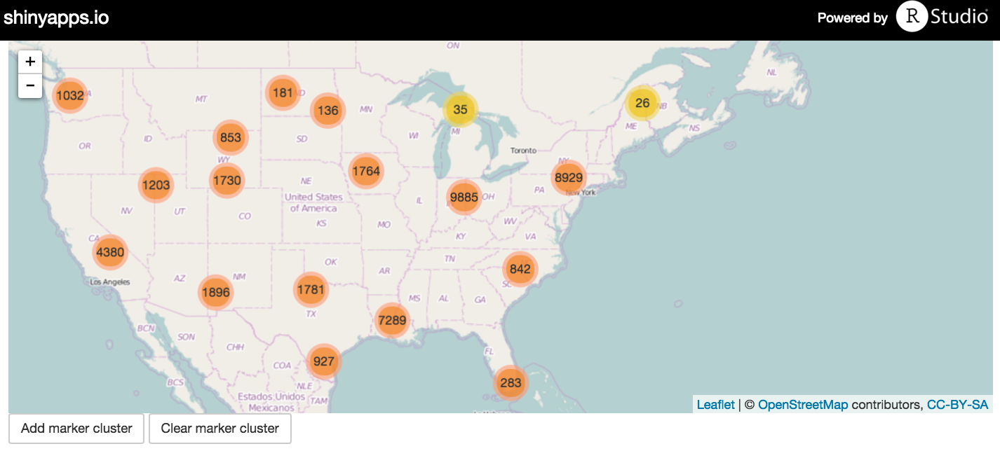

## Statistical learning

<div class="centered">

</div>

- http://www-bcf.usc.edu/~gareth/ISL/
- http://www.dataschool.io/15-hours-of-expert-machine-learning-videos/

## Labs (12:30-1:30pm)

- 11/19 – FXB G11
- 12/7 – FXB G10
- 12/14 – FXB G10

# Retrieving data

## URL's

http://aqsdr1.epa.gov/aqsweb/aqstmp/airdata/download_files.html

<iframe src="http://aqsdr1.epa.gov/aqsweb/aqstmp/airdata/download_files.html"></iframe>

## URL's

```{r eval=FALSE}
f <- "http://aqsdr1.epa.gov/aqsweb/aqstmp/airdata/annual_all_2015.zip"
tmp <- tempfile()
download.file(f, tmp)
unzip(tmp, "annual_all_2015.csv")
```

```{r warning = FALSE}
library(data.table)
dat <- fread("annual_all_2015.csv")
dat
```

## URL's

Find patterns in filenames

```{r}
years <- 2010:2015
files <- paste0("http://aqsdr1.epa.gov/aqsweb/aqstmp/airdata/annual_all_",
                years, ".zip")
files
```

## URL's

Create a small utility function

```{r}
download_epa_aqs <- function(years) {
  files <- paste0("http://aqsdr1.epa.gov/aqsweb/aqstmp/airdata/annual_all_",
                  years, ".zip")
  for (i in seq(years)) {
    tmp <- tempfile()
    download.file(files[i], tmp)
    unzip(tmp, paste0("annual_all_", years[i], ".csv"))
  }
}
```

```{r eval = FALSE}
download_epa_aqs(2000:2002)
```

## Scraping

http://energyalmanac.ca.gov/electricity/web_qfer/Heat_Rates.php

<iframe src="http://energyalmanac.ca.gov/electricity/web_qfer/Heat_Rates.php"></iframe>

## Scraping

```{r}
library(XML)
f <- "http://energyalmanac.ca.gov/electricity/web_qfer/Heat_Rates.php"
d <- readHTMLTable(f, which = 1)
head(d)
```

## Scraping

https://en.wikipedia.org/wiki/List_of_highest-grossing_films

<iframe src="https://en.wikipedia.org/wiki/List_of_highest-grossing_films"></iframe>

## Scraping

```{r warning=FALSE}
library(rvest)
d <- read_html("https://en.wikipedia.org/wiki/List_of_highest-grossing_films") %>%
  html_node(".wikitable") %>% 
  html_table()
```

## Scraping

```{r warning=FALSE}
head(d)
```

## Scraping

<div align="center">

</div>

http://www.imdb.com/title/tt0053779/

## Scraping

```{r}
read_html("http://www.imdb.com/title/tt0053779/") %>%
  html_nodes("#titleCast .itemprop span") %>%
  html_text()
```

## Scraping

```{python eval=FALSE}
import imdb
access = imdb.IMDb()
movie = access.get_movie(53779)
print movie # La dolce vita
```

http://www.crummy.com/software/BeautifulSoup/

<iframe src="http://www.crummy.com/software/BeautifulSoup/"></iframe>

## API's (more in March 2016)

- Application Programming Interface

- Example: census data.  Key required: http://api.census.gov/data/key_signup.html

- http://rstudio-pubs-static.s3.amazonaws.com/19337_2e7f827190514c569ea136db788ce850.html

# Spatial data

## Coordinate reference systems (CRS)

```{r warning=FALSE}
d <- fread("annual_all_2015.csv")
names(d)
d <- d[! `State Name` %in% c("Hawaii", "Puerto Rico", "Alaska")]
d <- d[`Parameter Code` == 88101]
```

## Coordinate reference systems (CRS)

```{r}
library(sp)
spD <- copy(d)
coordinates(spD) <- ~ Longitude + Latitude
```

## Coordinate reference systems (CRS)

```{r}
plot(spD)
```

## Coordinate reference systems (CRS)

```{r}
library(ggmap, quietly = TRUE)
usa <- map_data("state")
ggplot() + geom_point(data = d, aes(Longitude, Latitude))
```

## Coordinate reference systems (CRS)

```{r}
ggplot() +
  geom_polygon(data=usa, aes(x = long, y = lat, group = group),
               color = "grey", fill = "white") + 
  geom_point(data = d, aes(Longitude, Latitude))
```

## Coordinate reference systems (CRS)

```{r}
ggplot() +
  geom_polygon(data=usa, aes(x = long, y = lat, group = group),
               color = "grey", fill = "white") + 
  geom_point(data = d, aes(Longitude, Latitude)) +
  coord_map("polyconic")
```

## Coordinate reference systems (CRS)

```{r}
ggplot() +
  geom_polygon(data = usa, aes(x = long, y = lat, group = group),
               color = "grey", fill = "white") + 
  geom_point(data = d, aes(Longitude, Latitude)) +
  coord_map("polyconic", orientation = c(141, -74, 0))
```

## Coordinate reference systems (CRS)

<div align="center">

</div>

## Coordinate reference systems (CRS)

- [Overview](https://www.nceas.ucsb.edu/~frazier/RSpatialGuides/OverviewCoordinateReferenceSystems.pdf)

- EPSG (European Petroleum Survey Group): _EPSG was a scientific organization with ties to the European petroleum industry consisting of specialists working in applied geodesy, surveying, and cartography related to oil exploration._

- CRS given by EPSG code
    - Latitude/Longitude
        - WGS84 (EPSG: 4326).  Google Earth.
        - NAD83 (EPSG:4269).  U.S. federal agencies.  Previously NAD27 (EPSG: 4267).
    - Projected
        - Mercator (EPSG: 3857)

```{r}
spD <- copy(d)
coordinates(spD) <- ~ Longitude + Latitude
proj4string(spD) <- CRS("+init=epsg:4326")
plot(spD)
spD2 <- spTransform(spD, CRS("+proj=longlat +datum=NAD83 +no_defs +ellps=GRS80 +towgs84=0,0,0"))
plot(spD2)
```

# Visualization

## `leaflet` (and grammars again)

```{r, warning=FALSE}
set.seed(02138)
small_d <- dplyr::sample_n(d, size = 100)
small_d <- dplyr::mutate(small_d,
                         popup_text = paste0(round(`Arithmetic Mean`, 2)))
library(leaflet)
```

## `leaflet` (and grammars again)

```{r, warning=FALSE}
leaflet(data = small_d) %>%
  addTiles() %>%  # Add default OpenStreetMap map tiles
  addMarkers(~Longitude, ~Latitude, popup = ~popup_text)
```

## `leaflet` (and grammars again)

```{r}
leaflet(data = d) %>%
  addTiles() %>%
  addMarkers(clusterOptions = markerClusterOptions()
)
```

## `googleVis`

https://cran.r-project.org/web/packages/googleVis/vignettes/googleVis_examples.html

```{r}
library(googleVis)
op <- options(gvis.plot.tag='chart')
```

## `googleVis`

```{r warning=FALSE}
D <- fread("annual_all_2015.csv")
small_d <- dplyr::mutate(small_d,
                         LatLong = paste(Latitude, Longitude, sep = ":"))
```

## `googleVis`

```{r results='asis'}
gvisGeoChart(small_d, "LatLong", options = list(region = "US"),
             hovervar = "popup_text")
```

## `googleVis`

```{r results='asis'}
gvisMap(small_d, "LatLong", options = list(region = "US"),
             tipvar = "popup_text")
```

## Interactivity: servers and Shiny 101

- https://cchoirat.shinyapps.io/cluster

<div align="center">

</div>

## Structure

- `ui.R`

- `server.R`

- Then application is deployed

## `ui.R`

```{r eval=FALSE}
shinyUI(fluidPage(
  leafletOutput('map1'),
  actionButton('add', 'Add marker cluster'),
  actionButton('clear', 'Clear marker cluster')
))
```

## `server.R`

```{r eval=FALSE}
d <- fread("annual_all_2015.csv")

shinyServer(function(input, output) {
  output$map1 = renderLeaflet({
    leaflet() %>% addTiles() %>% setView(-97, 41, 4)
  })
  observeEvent(input$add, {
    leafletProxy('map1') %>% addMarkers(
      data = d,
      popup = ~sprintf('PM 2.5 = %s', round(`Arithmetic Mean`, 2)), layerId = rownames(d),
      clusterOptions = markerClusterOptions(), clusterId = 'cluster1'
    )
  })
  observeEvent(input$clear, {
    leafletProxy('map1') %>% clearMarkerClusters()
  })
})
```

## Javascripts libraries

http://rcharts.io/gallery/

<iframe src="http://rcharts.io/gallery/"></iframe>

## Javascripts libraries

http://www.htmlwidgets.org/

<iframe src="http://www.htmlwidgets.org/showcase_leaflet.html"></iframe>
