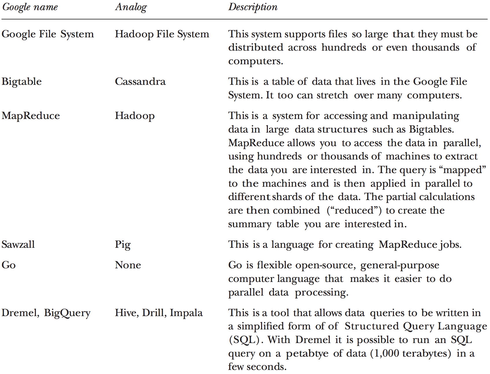
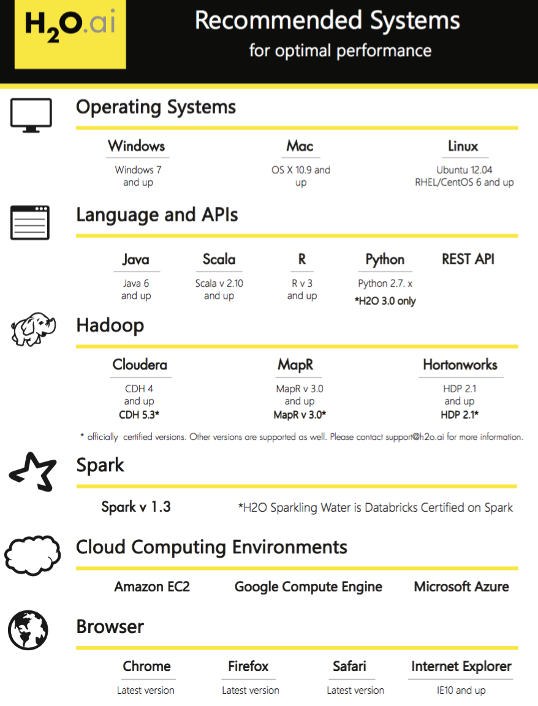
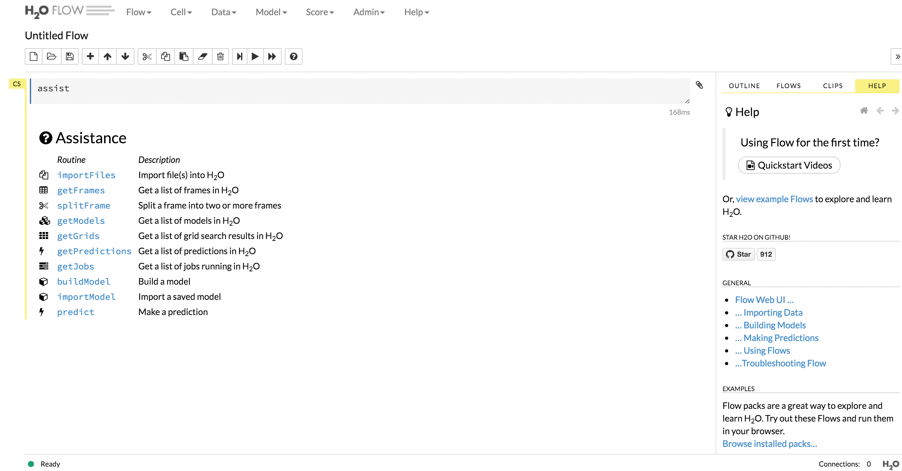
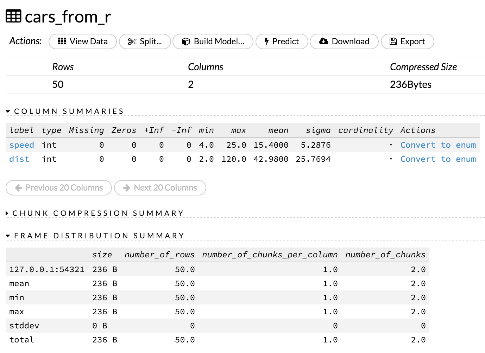
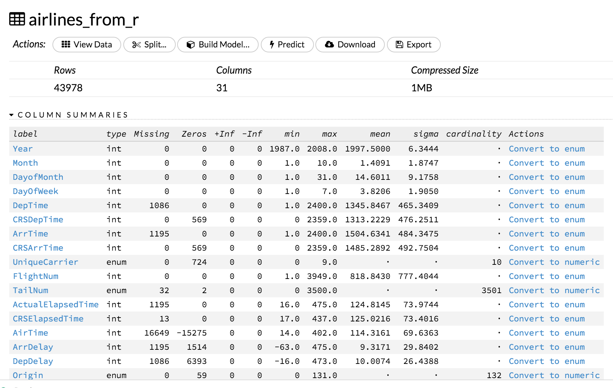
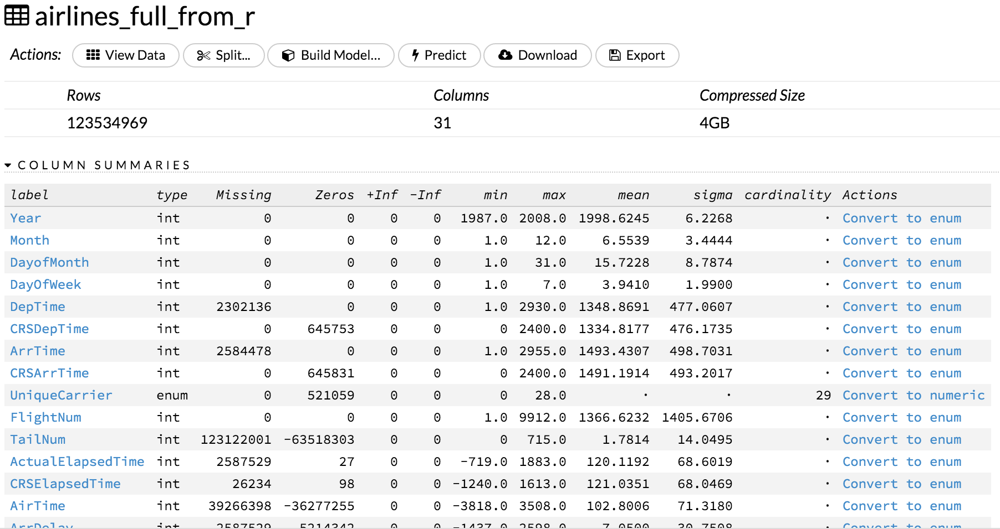
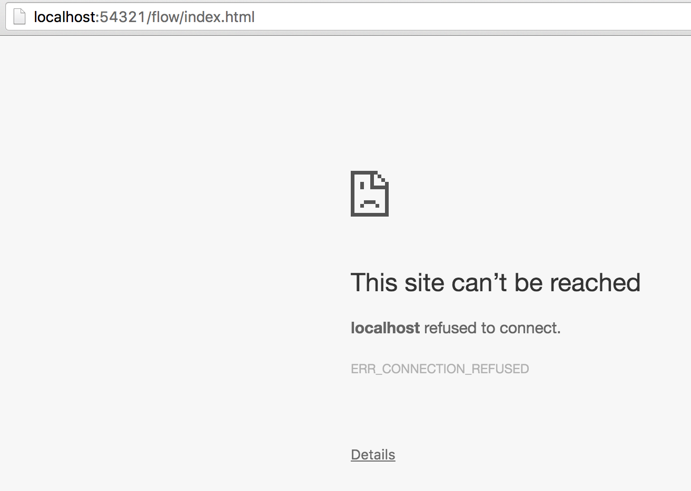

## Buzzword quizz

- The Sexiest Job of the 21st Century
- MapReduce
- Hadoop
- HDFS
- Spark
- Mahout
- GPU
- AWS
- Cloudera

## Recommended reading

Varian, Hal R. 2014. "Big Data: New Tricks for Econometrics." Journal of Economic Perspectives, 28(2): 3-28.

https://www.aeaweb.org/articles.php?doi=10.1257/jep.28.2.3

(Hal Varian is chief economist at Google.)

## Big data tools (Varian, 2014)

<div class="centered">

</div>

## How to deal with (very / too) large datasets?

1. Use more RAM / processors / drive space...
2. Use less data: (re)sample, ...
3. Use a database
4. Use specific R packages
5. Use other tools

## How big is big?

1. Fits in RAM and on drive (but slow)
2. Doesn't fit in RAM but fits on drive
3. Doesn't fit in RAM and doesn't fit on drive

## Canonical example: airline on-time performance

http://www.transtats.bts.gov/Fields.asp?Table_ID=236

http://www.transtats.bts.gov/DL_SelectFields.asp?Table_ID=236&DB_Short_Name=On-Time

https://github.com/h2oai/h2o-2/wiki/Hacking-Airline-DataSet-with-H2O

## Canonical example: airline on-time performance

> Airlines all years 1987-2008:
>
> https://s3.amazonaws.com/h2o-airlines-unpacked/allyears.csv (12 GB)
>
> 10x version:
>
> https://s3.amazonaws.com/h2o-airlines-unpacked/allyears_10.csv (120 GB)
>
> Sample of 2000 rows:
>
> https://s3.amazonaws.com/h2o-airlines-unpacked/allyears2k.csv (4.5 MB)

## Brute force (12 Gb dataset with 4 Gb of RAM)

### `data.table`

```{r, eval = FALSE}
d <- data.table::fread("~/Downloads/allyears.csv")
```

__(+)__ pure R solution from a user perspective, very efficient I/O

__(-)__ when it fits in RAM...

I just crashed my R session / computer :-(

There are R packages (`bigmemory`, `ff`) and R distributions (Revolution R Open) that try to address the problem:

https://cran.r-project.org/web/views/HighPerformanceComputing.html

## `ff`

https://cran.r-project.org/web/packages/ff/index.html

__ff__: memory-efficient storage of large data on disk and fast access functions

The ff package provides data structures that are stored on disk but behave (almost) as if they were in RAM by transparently mapping only a section (pagesize) in main memory - the effective virtual memory consumption per ff object.

## `ff`

http://www.bnosac.be/index.php/blog/22-if-you-are-into-large-data-and-work-a-lot-package-ff
http://hsinay.blogspot.com/p/big-data-analysis-using-ff-and-12-nov.html

__(+)__: pure R solution from a user perspective, more native types, package extensions (`ffbase`: Basic Statistical Functions)

__(-)__: documentation a little hard to find

## `ff`

```{r eval=FALSE}
library("ff")
x <- read.csv.ffdf(file = "~/Downloads/allyears.csv",
                   header = TRUE, VERBOSE = TRUE, 
                   nrows = 1000000,
                   first.rows = 50000, next.rows = 50000,
                   colClasses = NA)
typeof(x) # list
is.data.frame(x) # FALSE
```

## `bigmemory`

https://cran.r-project.org/web/packages/bigmemory/index.html

__bigmemory__: Manage Massive Matrices with Shared Memory and Memory-Mapped Files

Create, store, access, and manipulate massive matrices. Matrices are allocated to shared memory and may use memory-mapped files. Packages 'biganalytics', 'bigtabulate', 'synchronicity', and 'bigalgebra' provide advanced functionality.

__(+)__ pure R solution from a user perspective

__(-)__ mostly for numeric data matrices

## `bigmemory`

```{r eval=FALSE}
library(bigmemory)
library(biganalytics)

x <- read.big.matrix(
  "~/Downloads/allyears.csv", header = TRUE ,
  backingfile = "~/Downloads/airline.bin",
  descriptorfile = "~/Downloads/airline.desc"
  )
```

## h2o: "Fast Scalable Machine Learning"

http://www.h2o.ai/

http://www.r-bloggers.com/scalable-machine-learning-for-big-data-using-r-and-h2o/

http://venturebeat.com/2014/11/07/h2o-funding/

## Motivation (interview with SriSatish Ambati, chief executive of H2O)

What’s more, H2O integrates nicely into the workflows of data scientists who are familiar with the R programming language. H2O itself is partly written in R — as well as Java and Python — and people can run H2O functions from R once they’ve also installed the H2O package for R. And part of that is by design: Like others who have built on R, Ambati wasn’t satisfied the performance of R on its own.

“I was literally fuming and sending notes to the founders of R,” he said. He ended up collaborating with R core member John Chambers, among others, to develop H2O.

## Ecosystem

<div class="centered">

</div>

## Java Development Kit (JDK) is needed

http://www.oracle.com/technetwork/java/javase/downloads/jdk8-downloads-2133151.html

## Running h20 locally within R

http://www.h2o.ai/download/h2o/r

https://cran.r-project.org/web/packages/h2o/index.html

```{r eval=FALSE}
if ("package:h2o" %in% search()) { detach("package:h2o", unload=TRUE) }
if ("h2o" %in% rownames(installed.packages())) { remove.packages("h2o") }
install.packages("h2o")
```

## Running h20 locally within R

```{r eval=FALSE}
library(h2o)
localH2O <- h2o.init(min_mem_size = "20g")
```

```{r eval=FALSE}
# h2o.init(ip = "localhost", port = 54321, startH2O = TRUE,
#          forceDL = FALSE, enable_assertions = TRUE, license = NULL,
#          nthreads = -2, max_mem_size = NULL, min_mem_size = NULL,
#          ice_root = tempdir(), strict_version_check = TRUE,
#          proxy = NA_character_, https = FALSE, insecure = FALSE,
#          username = NA_character_, password = NA_character_)
```

(No persistence beyond the R session when h2O is started from R.)

## H2O Java Virtual Marchine (JVM)

```{r eval=FALSE}
java version "1.8.0_73"
Java(TM) SE Runtime Environment (build 1.8.0_73-b02)
Java HotSpot(TM) 64-Bit Server VM (build 25.73-b02, mixed mode)

Starting H2O JVM and connecting: .. Connection successful!

R is connected to the H2O cluster: 
    H2O cluster uptime:         1 seconds 772 milliseconds 
    H2O cluster version:        3.8.1.3 
    H2O cluster name:           H2O_started_from_R_cchoirat_nwc910 
    H2O cluster total nodes:    1 
    H2O cluster total memory:   19.17 GB 
    H2O cluster total cores:    8 
    H2O cluster allowed cores:  2 
    H2O cluster healthy:        TRUE 
    H2O Connection ip:          localhost 
    H2O Connection port:        54321 
    H2O Connection proxy:       NA 
    R Version:                  R version 3.2.3 (2015-12-10)

```

## JVM (from Wikipedia)

A Java virtual machine (JVM) is an abstract computing machine that enables a computer to run a Java program. There are three notions of the JVM: specification, implementation, and instance. The specification is a document that formally describes what is required of a JVM implementation.

(https://en.wikipedia.org/wiki/Java_virtual_machine)

## Which languages? (from Wikipedia)

This list of JVM Languages comprises notable computer programming languages that are used to produce software that runs on the Java Virtual Machine (JVM). Some of these languages are interpreted by a Java program, and some are compiled to Java bytecode and JIT-compiled during execution as regular Java programs to improve performance.

## Which languages? (from Wikipedia)

https://en.wikipedia.org/wiki/List_of_JVM_languages

- Java
- Clojure, a functional Lisp dialect
- Groovy, a programming and scripting language
- Scala, an object-oriented and functional programming language[1]
- JRuby, an implementation of Ruby
- Jython
- R (an implementation of R: https://en.wikipedia.org/wiki/Renjin)

## State of the JVM

```{r eval=FALSE}
h2o.clusterInfo()
```

```{r eval=FALSE}
R is connected to the H2O cluster: 
    H2O cluster uptime:         8 minutes 44 seconds 
    H2O cluster version:        3.8.1.3 
    H2O cluster name:           H2O_started_from_R_cchoirat_nwc910 
    H2O cluster total nodes:    1 
    H2O cluster total memory:   19.17 GB 
    H2O cluster total cores:    8 
    H2O cluster allowed cores:  2 
    H2O cluster healthy:        TRUE 
    H2O Connection ip:          localhost 
    H2O Connection port:        54321 
    H2O Connection proxy:       NA 
    R Version:                  R version 3.2.3 (2015-12-10) 
```

## http://localhost:54321/flow/index.html

<div class="centered">

</div>

## Importing data into h2o from the R session

```{r eval=FALSE}
data(cars)
cars_to_h2o <- as.h2o(cars, destination_frame = "cars_from_r")
is.data.frame(cars_to_h2o) # FALSE
class(cars_to_h2o) # H2OFrame
```

## h2o functions

```{r eval=FALSE}
summary(cars_to_h2o) # calls h2o::summary(cars_to_h2o)
```


```{r eval=FALSE}
 speed          dist            
 Min.   : 4.0   Min.   :  2.00  
 1st Qu.:12.0   1st Qu.: 26.00  
 Median :15.0   Median : 36.00  
 Mean   :15.4   Mean   : 42.98  
 3rd Qu.:19.0   3rd Qu.: 56.00  
 Max.   :25.0   Max.   :120.00  
Warning message:
In summary.H2OFrame(cars_to_h2o) :
  Approximated quantiles computed! If you are interested in exact quantiles,
  please pass the `exact_quantiles=TRUE` parameter.
```

## Importing data into h2o from the R session (in the browser: 'Data' -> 'List All Frames')

<div class="centered">

</div>

## Importing data into h2o from disk

```{r eval=FALSE}
airlines_path <- "/Users/cchoirat/Downloads/allyears2k.csv" # full path
airlines_to_h2o <- h2o.importFile(path = airlines_path,
                                  destination_frame = "airlines_from_r")
summary(airlines_to_h2o)
```

<div class="centered">

</div>

## Importing the full dataset into h2o from disk

```{r eval=FALSE}
airlines_full_path <- "/Users/cchoirat/Downloads/allyears.csv" # full path
airlines_full_to_h2o <- h2o.importFile(path = airlines_full_path,
                                       destination_frame = "airlines_full_from_r")
summary(airlines_to_h2o)
```

## Importing the full dataset into h2o from disk

<div class="centered">

</div>

## What happens with a call to `h2o::summary`?

```{r eval=FALSE}
summary(airlines_full_to_h2o)
dim(airlines_full_to_h2o) # 123534969 x 31
```

behaves just like base R `summary` but under the hood, it triggers a connection to the running h2o instance.

## Running a GLM model

```{r eval=FALSE}
h2ofit <- h2o.glm(y = "IsArrDelayed", x = "Distance",
                  training_frame = airlines_full_to_h2o,
                  family = "binomial")
h2ofit
summary(h2ofit)
```

```{r eval=FALSE}
airlines <- read.csv("~/Downloads/allyears2k.csv")
rfit <- glm(IsArrDelayed ~ Distance, data = airlines, family = binomial(link = "logit"))
summary(rfit)
```

```{r eval=FALSE}
Coefficients:
             Estimate Std. Error z value Pr(>|z|)    
(Intercept) 1.757e-01  1.546e-02  11.361  < 2e-16 ***
Distance    6.642e-05  1.666e-05   3.986 6.71e-05 ***
```

## Running a GLM model

```{r eval=FALSE}
h2ofit <- h2o.glm(y = "IsArrDelayed", x = "Distance",
                  training_frame = airlines_to_h2o,
                  standardize = FALSE,
                  family = "binomial")
h2ofit
```

```{r eval=FALSE}
Coefficients: glm coefficients
      names coefficients
1 Intercept     0.175590
2  Distance     0.000066
```

## And it does work on the full dataset

```{r eval=FALSE}
h2ofit_full <- h2o.glm(y = "IsArrDelayed", x = "Distance",
                       training_frame = airlines_full_to_h2o,
                       standardize = FALSE,
                       family = "binomial")
h2ofit_full
```

```{r eval=FALSE}
Coefficients: glm coefficients
      names coefficients
1 Intercept    -0.071491
2  Distance     0.000040
``` 

## Closing the h2o session

```{r eval=FALSE}
h2o.shutdown()
```

<div class="centered">

</div>

## Available algorithms

- Deep learning
- Distributed randon forest
- Gradient boosting method
- Generalized linear modeling
- Generalized low rank modeling
- K-means
- Naive Bayes
- Principal component analysis

## How to incorporate new models in h2o?

__(+)__ built-in models behave very much like R and are scalable

__(-)__ not easy to extend (*e.g*., GLM https://github.com/h2oai/h2o-3/blob/master/h2o-algos/src/main/java/hex/glm/GLM.java)

